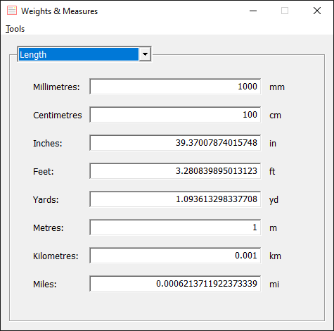

Weights & Measures
==================

Weights & Measures is a unit converter for Windows. It has an extensible design, allowing new categories and units to be easily added.

Notes
-----

The program comes with a default language of English and can be translated into others. To do so, open the "English.lng" file in a plain-text editor, like Notepad, and translate all the words on the right-hand side of the equal-to sign (=). Then, save it as another file, using UTF-8 encoding without the byte-order mark, or plain ANSI. Lastly, rename the file to that of the language: "French.lng" for example. The extension must be ".lng" for the file to be recognised.

Download Weights & Measures only from its [official page](https://github.com/GeoffreyAA/weights-measures). This is free software; do not pay for it anywhere.

The main executable, WM.exe, is the 64-bit x86 build and should work on Windows 7 and higher. The 32-bit build, WM32.exe, should work on XP.

Building
--------

Weights & Measures can be compiled with Visual Studio 2026. Open the solution file, WM.sln, set the configuration, and compile; it is set to link statically, so no redistributable files are needed. MFC must be installed:

	C++ MFC for x64/x86 (Latest MSVC)

To target XP, use the "Release-XP" configuration. The following components must be installed:

	C++ Windows XP Support for VS 2017 (v141) tools
	MSVC v141 - VS 2017 C++ x64/x86 build tools (v14.16)
	C++ MFC for v141 build tools (x86 & x64)

References
----------

The sources of information used at some time or other include:

* The Wikipedia article *Conversion of units,* which is the chief source, and many articles that lead from there.
* The Wikipedia template *Quantities of bytes.*
* *The Pocket Oxford Dictionary of Current English,* ed. R. E. Allen (7th edition, Oxford: Clarendon Press, 1984).
* *The Book of Knowledge,* ed. Gordon Stowell (5th edition, revised impression, London: The Waverley Book Company Ltd., 1957).
* Furey, Edward. *Pixels Per Inch PPI Calculator* at https://www.calculatorsoup.com/calculators/technology/ppi-calculator.php from CalculatorSoup, https://www.calculatorsoup.com - Online Calculators